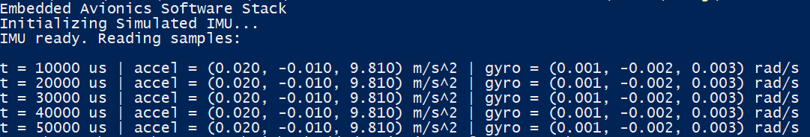
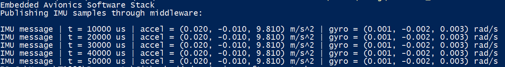

# Embedded Avionics Sensor Platform

A portable C++ avionics software platform demonstrating sensor-driver abstraction, publish-subscribe middleware, sensor health monitoring, time synchronization, fault injection, and software-in-the-loop (SIL) validation.

The project is designed as a portable, hardware-independent embedded avionics software stack. The architecture is intentionally structured to enable future integration with PX4, uORB, and NuttX.

## Project Objectives

- Develop modular drivers for IMU, GNSS, barometer, and air-data sensors.
- Decouple flight applications from hardware-specific sensor implementations.
- Implement lightweight publish-subscribe middleware.
- Detect stale, invalid, and unavailable sensor measurements.
- Generate time-aligned sensor data for flight-control and navigation modules.
- Validate nominal and fault scenarios through automated tests.
- Provide a migration path to PX4/uORB and NuttX.

## Current Development Phase

Phase 1 focuses on a portable Windows-compatible C++ implementation using
simulated avionics sensors and software-in-the-loop tests.

Phase 2 will add PX4 SITL, uORB adapters, and NuttX-target validation on Ubuntu.

---

## Planned Sensors
- IMU
- GNSS
- Barometer
- Air-data sensor

---

## System Architecture

```mermaid
flowchart TB

subgraph Sensors
IMU
GNSS
Barometer
AirData
end

subgraph Drivers
SensorDrivers
end

subgraph Middleware
MessageBus
SensorManager
HealthMonitor
TimeSynchronization
end

subgraph FlightSoftware
Navigation
FlightController
Telemetry
end

Sensors --> SensorDrivers
SensorDrivers --> MessageBus
MessageBus --> SensorManager
SensorManager --> TimeSynchronization
SensorManager --> HealthMonitor

TimeSynchronization --> Navigation
HealthMonitor --> Navigation

Navigation --> FlightController
FlightController --> Telemetry

````
## Current Progress

### Simulated IMU Driver

The first sensor driver has been implemented using a hardware-independent driver interface. The simulation currently produces deterministic IMU data at 100 Hz to support software-in-the-loop (SIL) development.

<p align="center">

</p>

---

### Publish–Subscribe Middleware

The simulated IMU driver now publishes timestamped sensor samples through a lightweight publish–subscribe message bus. Subscribers receive sensor data without depending directly on the driver implementation, enabling future platform backends for PX4/uORB, STM32 RTOS queues, and QNX message passing.

<p align="center">
  
</p>

---

## Technologies
- C++17
- CMake
- Unit and integration testing
- GitHub Actions
- PX4/uORB integration planned
- NuttX validation planned

---