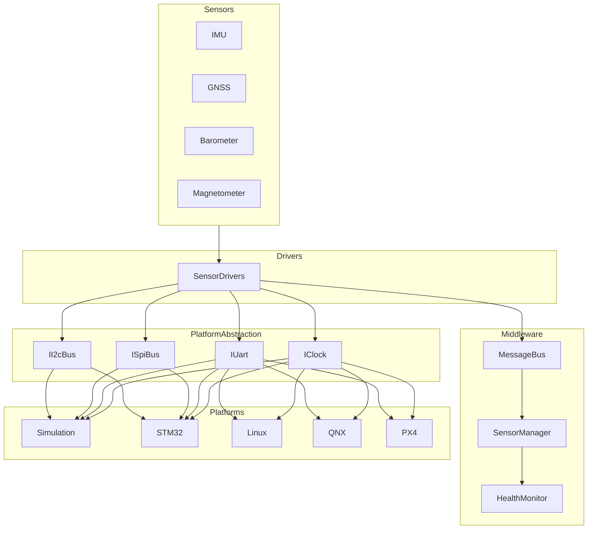
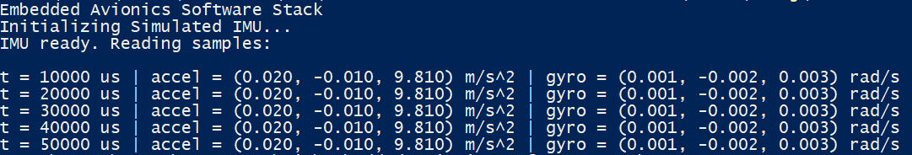

# Embedded Avionics Sensor Platform

## Overview

This project implements a modular **Embedded Avionics Software Stack** in modern **C++17**, following a layered architecture for aerospace and autonomous flight systems.

The stack demonstrates an end-to-end development path from **software-in-the-loop (SIL) simulation to physical embedded hardware**, covering sensor drivers, publish–subscribe middleware, synchronized sensor management, health monitoring, platform abstraction, PX4/uORB integration, NuttX cross-target validation, and deployment on an **STM32F401RE** with a real **u-blox NEO-M8N GNSS receiver**.

The architecture separates hardware-independent avionics logic from platform-specific implementations through common interfaces, allowing the same sensor and application-level concepts to be exercised across simulation, Linux, PX4/NuttX, and STM32 targets.

Current implementation includes:

- Modular C++17 sensor-driver architecture
- Multi-rate IMU, GNSS, barometer, and magnetometer simulation
- Lightweight publish–subscribe middleware
- Multi-sensor synchronization and centralized Sensor Manager
- Sensor Health Monitoring
- Fault Injection & Automatic Recovery
- Hardware-independent Platform Abstraction Layer
- Software-in-the-loop (SIL) and Linux runtime validation
- PX4/uORB sensor-monitoring integration and Gazebo SITL validation
- NuttX / ARM Cortex-M7 cross-target firmware validation
- STM32F401RE hardware backend using STM32 HAL
- Physical `IClock` and `IUart` backend validation
- Real NEO-M8N GNSS integration over UART
- Embedded NMEA GGA parsing and GNSS fix validation
- Hardware-timestamped GNSS measurements mapped to the common `GnssSample` data model
- Requirements, verification traceability, fault analysis, and project-level HARA

The resulting project demonstrates the progression:

```text
SIL Simulation
      ↓
Linux / POSIX
      ↓
PX4 / uORB / Gazebo SITL
      ↓
NuttX Cross-Target Build
      ↓
STM32 Physical Hardware
      ↓
Real NEO-M8N GNSS
```

## Project Objectives

- Develop modular drivers for IMU, GNSS, barometer, and magnetometer sensors.
- Decouple flight applications from hardware-specific sensor implementations.
- Implement lightweight publish-subscribe middleware.
- Detect stale, invalid, and unavailable sensor measurements.
- Generate time-aligned sensor data for flight-control and navigation modules.
- Validate nominal and fault scenarios through automated tests.
- Provide a migration path to PX4/uORB and NuttX.

## Current Development Phase

The project has progressed from a host-based software-in-the-loop prototype
to a cross-platform embedded avionics stack validated across simulation,
Linux, PX4/NuttX, and physical STM32 hardware.

Completed development stages include:

- Multi-rate simulated sensor drivers
- Publish–Subscribe middleware
- Multi-sensor synchronization through the Sensor Manager
- Sensor Health Monitoring
- Fault Injection & Automatic Recovery
- Hardware-independent Platform Abstraction Layer
- Windows and Linux SIL validation
- PX4/uORB integration with Gazebo SITL
- NuttX ARM cross-target firmware validation
- STM32F401RE hardware backend
- Physical `IClock` and `IUart` validation
- Real NEO-M8N GNSS integration
- Embedded NMEA parsing and timestamped GNSS measurements
- Requirements, verification traceability, and project-level HARA

Further extensions may include additional physical sensors, CAN/Ethernet
interfaces, and deployment to PX4 flight-controller hardware.

---

## Implemented Sensors

- ✅ IMU (100 Hz)
- ✅ Magnetometer (50 Hz)
- ✅ Barometer (25 Hz)
- ✅ GNSS (10 Hz)

Future:

- ⬜ Air-data sensor

---

## System Architecture


```mermaid
flowchart TD

subgraph Sensors
IMU
GNSS
Barometer
Magnetometer
end

subgraph Drivers
SensorDrivers
end

subgraph Middleware
MessageBus
SensorManager
HealthMonitor
end

subgraph PlatformAbstraction
IClock
IUart
ISpiBus
II2cBus
end

subgraph Platforms
Simulation
STM32
Linux
QNX
PX4
end

Sensors --> SensorDrivers
SensorDrivers --> MessageBus
MessageBus --> SensorManager
SensorManager --> HealthMonitor

SensorDrivers --> IClock
SensorDrivers --> IUart
SensorDrivers --> ISpiBus
SensorDrivers --> II2cBus

IClock --> Simulation
IClock --> STM32
IClock --> Linux
IClock --> QNX
IClock --> PX4

IUart --> Simulation
IUart --> STM32
IUart --> Linux
IUart --> QNX
IUart --> PX4

ISpiBus --> Simulation
ISpiBus --> STM32

II2cBus --> Simulation
II2cBus --> STM32
```

## Current Progress

### Simulated IMU Driver

The first sensor driver has been implemented using a hardware-independent driver interface. The simulation currently produces deterministic IMU data at 100 Hz to support software-in-the-loop (SIL) development.

<p align="center">

</p>

---

### Publish–Subscribe Middleware

The embedded middleware implements a lightweight publish–subscribe architecture that decouples sensor drivers from higher-level avionics applications. Each sensor publishes timestamped measurements at its own sampling frequency, allowing multiple independent subscribers such as the Sensor Manager, telemetry modules, logging, and future navigation algorithms.

Implemented publishing rates:

IMU — 100 Hz
Magnetometer — 50 Hz
Barometer — 25 Hz
GNSS — 10 Hz


<p align="center"> 

</p>

---

### Sensor Manager

The Sensor Manager subscribes to all middleware topics and maintains the latest valid measurement from each sensor. It provides a synchronized system-wide sensor state that can later be consumed by navigation, flight-control, and health-monitoring modules.

Current responsibilities include:

- Latest valid sample management
- Multi-sensor synchronization
- Timestamp consistency
- Centralized sensor access
- Hardware-independent interface

<p align="center"> 
 
</p>

---

## Sensor Health Monitoring

The Sensor Health Monitor continuously evaluates the operational state of each sensor using timestamp-based freshness monitoring.

Current capabilities:

- Latest sample validation
- Timestamp consistency checks
- Stale sensor detection
- Overall system health evaluation
- Automatic recovery after communication restoration

Each sensor is classified as:

- **HEALTHY**
- **STALE**
- **UNAVAILABLE**

A GNSS communication dropout is intentionally injected into the software-in-the-loop simulation.

The Health Monitor detects stale sensor data, transitions the system state to **DEGRADED**, and automatically restores the system to **HEALTHY** once valid GNSS data resumes.

### Fault Detection

<p align="center">

</p>

### Automatic Recovery

<p align="center">

</p>


This demonstrates the complete fault lifecycle:

```
Normal Operation
        ↓
GNSS Communication Dropout
        ↓
STALE Sensor Detection
        ↓
Overall System DEGRADED
        ↓
GNSS Recovery
        ↓
Automatic System Recovery
```

---

## Platform Abstraction Layer

The project introduces a hardware-independent platform abstraction layer that isolates embedded sensor drivers from operating system and hardware-specific implementations.

Current interfaces:

| Interface | Purpose |
|-----------|----------|
| **IClock** | Common timestamp source |
| **IUart** | UART communication |
| **ISpiBus** | SPI communication |
| **II2cBus** | I²C communication |

Current platform implementations and validation targets:

- Simulation
- Linux/POSIX
- STM32 HAL
- PX4/NuttX

Future platform extension:

- QNX

Using dependency injection, sensor drivers depend only on abstract interfaces rather than platform-specific APIs.

Consequently, migrating the software to another operating system or hardware platform requires only a new platform implementation while the driver logic remains unchanged.

--- 

## Cross-Platform Validation

The Embedded Avionics Software Stack has been successfully validated on both Windows and Ubuntu Linux.

| Platform | Compiler | Status |
|----------|----------|--------|
| Windows 11 | MSVC | ✅ |
| Ubuntu 22.04 | GCC 11.4 | ✅ |

### Linux Build


### Linux Runtime Validation


---


## Safety Engineering & Verification

The software stack includes a lightweight safety-oriented development workflow
linking software requirements, representative avionics hazards, implemented
mitigations, and verification evidence.

The current documentation includes:

- **[Software Requirements](docs/safety/software_requirements.md)**  
  Functional, health-monitoring, platform-abstraction, and PX4 integration
  requirements.

- **[Software Verification Matrix](docs/safety/verification_matrix.md)**  
  Requirement-to-verification traceability covering SIL fault injection,
  integration testing, Linux runtime validation, PX4 SITL, and NuttX/STM32H7
  cross-target validation.

- **[Project-Level Hazard Analysis](docs/safety/hara.md)**  
  Representative sensor/software failure conditions, severity assessment,
  detection mechanisms, mitigations, residual risks, and requirement
  traceability.

### Verification Flow

```text
Hazard
   ↓
Software Requirement
   ↓
Implementation / Mitigation
   ↓
SIL / Integration / Build Verification
   ↓
PASS / NOT TESTED
```

---


Scope: This is a project-level demonstration of safety-oriented avionics
software development and traceability. It does not claim compliance with a
formal aircraft certification standard.

---

## STM32 Hardware Implementation

The platform abstraction layer has been extended from the host-based
Linux/POSIX implementation to a physical STM32 target using a
NUCLEO-F401RE (ARM Cortex-M4F).

The STM32 target is cross-compiled using `arm-none-eabi-gcc/g++` and
integrates STM32F4 HAL/CMSIS with board-specific startup and linker
configuration.

### STM32F401RE Hardware Validation

The initial hardware implementation validates the `IClock` abstraction
on the physical STM32F401RE target.

Implemented and validated:

- ARM Cortex-M4F cross-compilation using CMake
- STM32F4 HAL/CMSIS integration
- board-specific startup and linker configuration
- `Stm32Clock` implementation of the common `IClock` interface
- firmware programming through ST-LINK/SWD using OpenOCD
- flash verification and target reset
- execution on physical STM32F401RE hardware
- GPIO timing validation using onboard LD2 (PA5)

#### ARM Firmware Build

The STM32 target is cross-compiled with the GNU Arm Embedded Toolchain
using a dedicated CMake toolchain configuration.


The build produces the target firmware image:

```text
avionics_stm32.elf
```

#### Firmware Programming and Verification


OpenOCD successfully programs the generated ARM ELF image, verifies the
flash contents, and resets the physical target.


#### Hardware Execution


The STM32 implementation of `IClock` drives a periodic GPIO toggle on
the physical NUCLEO-F401RE, providing a simple observable validation of
the hardware timing backend.


### STM32 UART Backend Validation

The common `IUart` platform interface was implemented for the
NUCLEO-F401RE using the STM32 HAL USART2 peripheral.

The STM32 backend encapsulates hardware-specific UART configuration and
communication behind the same portable interface used by the simulated
platform implementation.

```text
Application
    |
    v
IUart
    |
    v
Stm32Uart
    |
    v
STM32 HAL
    |
    v
USART2 (PA2 / PA3)
    |
    v
ST-LINK Virtual COM Port
    |
    v
Ubuntu /dev/ttyACM0
```

The implementation provides:

- open()
- close()
- isOpen()
- read()
- write()

The application no longer accesses HAL_UART_Transmit() or peripheral
configuration directly. UART initialization and data transfer are isolated
inside the Stm32Uart hardware backend.

#### Runtime Validation

The STM32 firmware was cross-compiled, flashed to the physical
NUCLEO-F401RE, and monitored from Ubuntu using Minicom at 115200 baud.

<p align="center">  </p>

The repeated runtime message:
```
STM32 IUart backend alive
```

confirms that:

- the STM32 firmware executes continuously on physical hardware
- the Stm32Uart implementation successfully initializes USART2
- the common IUart::write() interface successfully transmits data
- UART data is received on Ubuntu through the ST-LINK Virtual COM Port

This validates the transition from the simulated UART backend to a
physical STM32 communication backend while preserving the common
platform abstraction.


## Real GNSS Hardware Integration — u-blox NEO-M8N

The STM32 hardware implementation was extended with a physical
u-blox NEO-M8N GNSS receiver, providing a real navigation-sensor
input to the avionics software stack.

Unlike the simulated GNSS driver used during SIL development, this
implementation receives actual NMEA navigation messages generated by
the NEO-M8N and processes them directly on the STM32F401RE.

The hardware integration therefore extends the validation chain from:

```
Simulated Sensor
      ↓
Platform Abstraction
      ↓
Avionics Software
```

to:

```
Physical GNSS Receiver
      ↓
STM32 Hardware UART
      ↓
Platform Abstraction
      ↓
GNSS Parser
      ↓
Common Avionics Sensor Model
```

### Hardware Setup

The NEO-M8N is connected to the STM32F401RE through a dedicated UART
receive path while USART2 remains available for debug output through
the ST-LINK Virtual COM Port.

<p align="center">  </p>

This provides two independent communication paths:

```
NEO-M8N
   |
   | NMEA UART
   v
STM32 USART1 / PA10
   |
   v
GNSS Driver / Parser


STM32 USART2
   |
   v
ST-LINK Virtual COM Port
   |
   v
Ubuntu / Minicom
```

The separation allows the STM32 to receive GNSS data while simultaneously
streaming diagnostic and processed navigation information to the host PC.

### Raw NMEA Acquisition

The first stage of GNSS hardware validation verifies reception of the
raw NMEA stream from the physical NEO-M8N receiver.

The STM32 successfully receives standard GNSS sentences including:
```
$GNGGA,...
$GNRMC,...
$GNVTG,...
$GNGSA,...
$GPGSV,...
$GLGSV,...
```
<p align="center">  </p>

This validates the complete physical communication path:

```
NEO-M8N
   ↓
UART electrical interface
   ↓
STM32 USART
   ↓
Stm32Uart
   ↓
Application
```

At this stage the STM32 is processing data originating from a real
navigation sensor rather than a simulated source.

### Embedded NMEA GGA Parser

A lightweight NmeaGgaParser was implemented to convert the incoming
NMEA GGA stream into structured navigation information.

The parser is located under the common GNSS driver layer:

```
include/avionics/drivers/gnss/
src/drivers/gnss/NmeaGgaParser.cpp
```

The parser extracts the navigation fields required by the avionics stack:

- GNSS fix validity
- number of satellites
- latitude
- longitude
- altitude

Both $GNGGA and $GPGGA GGA sentence variants can be processed.

The resulting data is independent of the textual NMEA representation and
can therefore be consumed directly by higher-level avionics software.

### Real GNSS Fix Validation

During hardware testing, the NEO-M8N successfully acquired a valid GNSS
position.

The STM32 received the raw NMEA stream, decoded the GGA sentence, and
reported:

- valid GNSS fix
- six satellites
- decoded latitude
- decoded longitude
- measured altitude

<p align="center">  </p>

Representative hardware output:

GNSS FIX: VALID | sats=6 | lat=... | lon=... | alt=... m

The small variation between successive position and altitude measurements
is consistent with live GNSS measurements and demonstrates that the values
originate from the physical receiver rather than a fixed simulation source.

### GNSS Timestamp Integration

The parsed GNSS measurement is subsequently mapped into the common avionics
GnssSample data structure defined in:

include/avionics/messages/SensorMessages.hpp

The STM32 `IClock` backend supplies the local acquisition timestamp,
combining the real sensor measurement with the same timing abstraction used
elsewhere in the avionics stack.

The resulting processing path is:

```
NEO-M8N
    |
    | Raw NMEA
    v
`Stm32Uart`
    |
    v
`NmeaGgaParser`
    |
    | Parsed GGA fix
    v
GNSS measurement
    |
    +---------- `Stm32Clock`
    |               |
    |          timestamp
    |               |
    +-------+-------+
            |
            v
        `GnssSample`
            |
            v
Higher-Level Avionics Software
```

Hardware timestamp validation demonstrates approximately one-second
measurement intervals:
```
GNSS SAMPLE | t=11463 ms | INVALID | sats=0
GNSS SAMPLE | t=12470 ms | INVALID | sats=0
GNSS SAMPLE | t=13466 ms | INVALID | sats=0
```

<p align="center">  </p>

This test also demonstrates explicit GNSS validity handling. When the
receiver does not have a usable navigation fix, the software propagates the
measurement as INVALID rather than presenting stale or unavailable position
data as valid.

### Simulation-to-Hardware Portability

The GNSS hardware implementation demonstrates the intended portability of
the avionics architecture.

During SIL validation:
```
Simulated GNSS Driver
        |
        v
    GnssSample
        |
        v
Avionics Application
```

On the physical STM32 target:

```
NEO-M8N
    |
    v
Stm32Uart
    |
    v
NmeaGgaParser
    |
    v
GnssSample
    |
    v
Avionics Application
```

Both paths converge on the same application-facing sensor representation.

This means higher-level modules such as the Sensor Manager, health monitoring,
navigation, and future flight-control software do not need to depend directly
on whether measurements originate from simulation or physical hardware.

The hardware-specific implementation remains isolated behind the platform and
driver layers.

### STM32 Hardware Validation Summary

| Capability                           | Validation |
| ------------------------------------ | ---------- |
| ARM Cortex-M4F cross-compilation     | ✅          |
| STM32 HAL/CMSIS integration          | ✅          |
| Startup/linker configuration         | ✅          |
| ST-LINK/SWD programming              | ✅          |
| OpenOCD flash verification           | ✅          |
| Physical firmware execution          | ✅          |
| `Stm32Clock` / `IClock` backend      | ✅          |
| GPIO timing validation               | ✅          |
| `Stm32Uart` / `IUart` backend        | ✅          |
| USART2 host communication            | ✅          |
| Physical NEO-M8N integration         | ✅          |
| Raw NMEA UART acquisition            | ✅          |
| Embedded NMEA GGA parsing            | ✅          |
| Real GNSS position acquisition       | ✅          |
| GNSS fix-validity handling           | ✅          |
| Hardware timestamp generation        | ✅          |
| Mapping to common `GnssSample` model | ✅          |

The STM32 implementation therefore validates an end-to-end embedded path from
physical navigation sensor → MCU peripheral → hardware abstraction →
sensor parser → timestamped avionics data model.

This complements the SIL, Linux, PX4, NuttX, requirements, verification, and
hazard-analysis work by demonstrating that the same architectural concepts can
be deployed and exercised on physical embedded avionics hardware.


---


## Project Status

### Completed

- Sensor Drivers
- Publish–Subscribe Middleware
- Sensor Manager
- Health Monitoring
- Fault Injection & Recovery
- Platform Abstraction
- Windows / Linux SIL Validation
- PX4 / uORB Integration
- Gazebo SITL Validation
- NuttX Cross-Target Build
- STM32 HAL Backend
- Physical STM32 Hardware Validation
- Real NEO-M8N GNSS Integration
- NMEA GGA Parser
- Requirements & Verification Traceability
- Project-Level HARA

### Future Extensions

- CAN bus integration
- Ethernet interface
- Physical IMU / barometer / magnetometer integration
- PX4 flight-controller hardware deployment


---

## Related Projects

### PX4 Avionics Sensor Monitor

A custom PX4 module developed to validate the embedded avionics concepts used in this repository against the PX4 flight-software ecosystem. This project demonstrates the same avionics software concepts implemented inside the PX4 flight stack.

The module demonstrates:

- Custom PX4 module development
- uORB middleware integration
- IMU and GNSS subscriptions
- Multi-rate sensor monitoring
- Sensor health diagnostics
- PX4 SITL / Gazebo validation

**Repository:** [px4-avionics-sensor-monitor](https://github.com/Vaiy108/px4-avionics-sensor-monitor)


## Technologies

- Modern C++17
- CMake
- STM32 HAL / CMSIS
- ARM GNU Embedded Toolchain
- STM32F401RE / ARM Cortex-M4F
- ST-LINK / OpenOCD
- u-blox NEO-M8N GNSS
- NMEA
- Linux / POSIX
- Windows / MSVC
- Ubuntu / GCC
- PX4
- uORB
- NuttX
- Gazebo SITL
- Publish–Subscribe Middleware
- Software-in-the-loop (SIL)
- Hardware-in-the-loop / Physical Hardware Validation
- Modular Sensor Drivers
- Platform Abstraction Layer
- Dependency Injection
- Git / GitHub

---

## Folder Structure

```
embedded-avionics-software-stack/

├── include/
│   └── avionics/
│       ├── drivers/
│       ├── middleware/
│       ├── messages/
│       ├── services/
│       └── platform/
│           ├── interfaces/
│           │   ├── IClock.hpp
│           │   ├── IUart.hpp
│           │   ├── ISpiBus.hpp
│           │   └── II2cBus.hpp
│           │
│           └── simulation/
│               ├── SimulationClock.hpp
│               ├── SimulatedUart.hpp
│               ├── SimulatedSpiBus.hpp
│               └── SimulatedI2cBus.hpp
│
├── src/
│   ├── drivers/
│   ├── middleware/
│   ├── services/
│   └── platform/
│       ├── simulation/
│       ├── stm32/
│       ├── linux/
│       ├── qnx/
│       └── px4/

```

## Roadmap

### Completed

- Sensor Drivers
- Middleware
- Sensor Manager
- Health Monitoring
- Fault Injection
- Platform Abstraction
- Linux Validation
- STM32 HAL Backend
- PX4 Integration
- NuttX Build
- Real GNSS Driver

---

## 👤 Author

**Vasan Iyer**  
GNC / Embedded Systems Engineer  

Focus areas:
 
- Embedded systems (C++, Python) 
- GNC
- Flight dynamics & control  
- Sensor fusion & state estimation  
- Autonomous systems  
- UAV systems 


GitHub: https://github.com/Vaiy108
